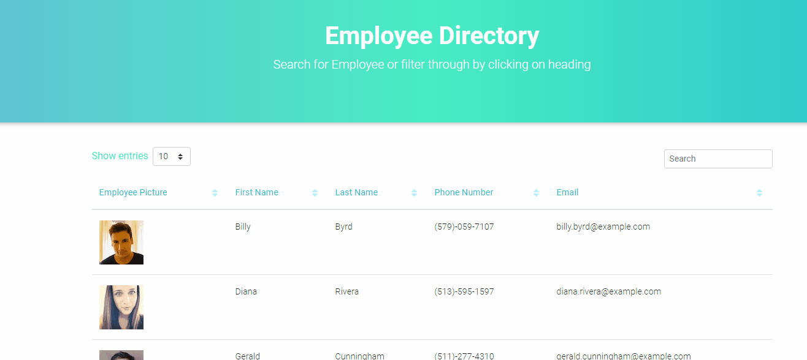

# HW19.employeeDirectory


For this assignment, you'll create a employee directory with React. This assignment will require you to break up your application's UI into components, manage component state, and respond to user events.

# Contents
1. [Deployed](#deployed)
2. [User Story](#user-story)
3. [Required criteria](#required-criteria)
4. [Criteria met](#criteria-met)
5. [Example](#example)

## Deployed
https://tanman5.github.io/HW19.employeesDirectory/

## User Story
As a user, I want to be able to view my entire employee directory at once so that I have quick access to their information.

## Required criteria

```
Given a table of random users, when the user loads the page, a table of employees should render.
The user should be able to:


Sort the table by at least one category


Filter the users by at least one property.
```

## Criteria met

```
I was able to create an app using Create React APP.  In the application I was able to sort through categories and was also able to search for an employee using the search box.

```

## Example
Main
